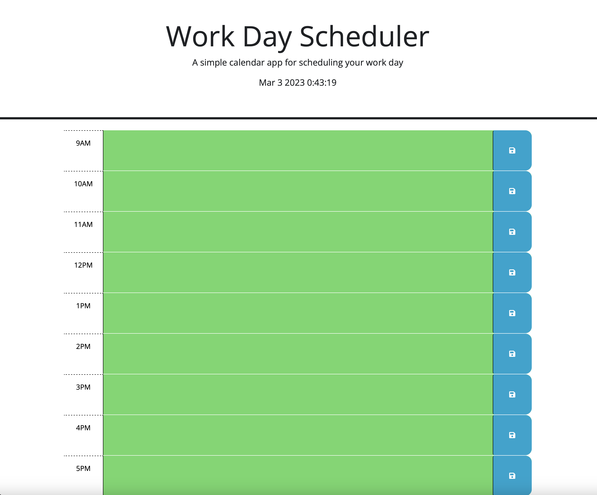

# WorkSchedule

 Welcome to the Work Schedule Web Site! This is a simple web application that allows you to save your work schedule from 9:00am to 5:00pm (09:00 to 17:00) and visually see the difference between past, present and future time slots.

## Features

* Save and view your work schedule from 9:00am to 5:00pm (09:00 to 17:00).
* Color coding to distinguish between past, present and future time slots.
* Easy to use interface to add and edit your work schedule.

## Getting Started

* Go to the website's URL in your preferred web browser.
* On the main page, you'll see a table representing your work schedule.
* Click on any time slot to edit its details or add a new entry.

The color of each time slot will automatically change based on whether it is in the past, present or future. This allows you to easily distinguish between the different time slots and manage your work schedule more effectively.

## Technologies Used

The Work Schedule Web Site is built using HTML, CSS, JavaScript, and jQuery. The data is stored on the local storage.

## Links
 
* Website
https://kristefov.github.io/WorkSchedule/

* Repo
https://github.com/kristefov/WorkSchedule

## Mock-Up

